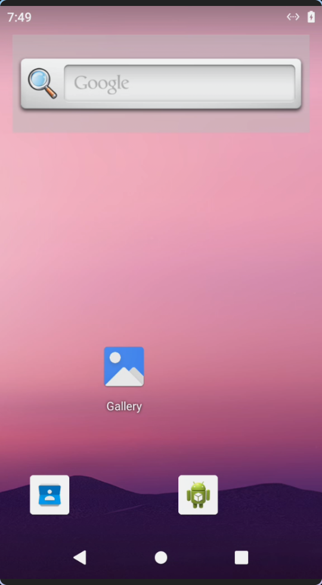
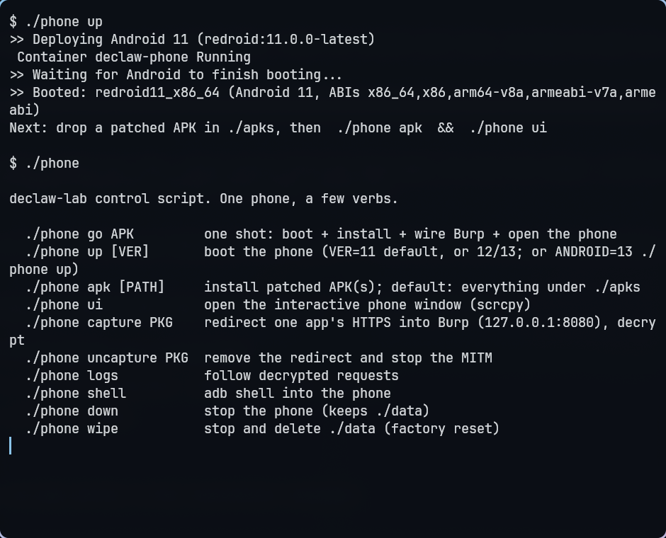

# declaw-lab

A throwaway Android phone in a container for testing declaw-patched apps. Boot it, drop a
patched APK in a folder, drive it like a real phone from your desktop, and capture its
HTTPS into Burp. No Frida, no cert install on the device.

It exists because "install the app and point Burp at it" gives you nothing for a Flutter
app: Flutter's network stack ignores the system proxy, so the classic proxy setup captures
zero traffic. This gives you a device where the whole capture chain already works, as long
as the APK was unpinned by [declaw](https://github.com/UncleJ4ck/declaw) first.

<p align="center">
  
</p>

## Backends: pick your device

declaw-env deploys the target device three ways. Pick by what you are testing:

| Backend | Command | Device | Speed | Root | Use it for |
|---|---|---|---|---|---|
| **redroid** | `./phone` | Android 11 container | boots ~6s | yes | Fast interactive capture; arm libs via translation |
| **qemu** | `./avd/lab qemu` | REAL aarch64 Android 16 (QEMU/TCG) | ~4 min boot | yes | declaw's arm64-only primitives (mempatch, HWBP) |
| **avd** | `./avd/lab avd` | x86_64 Android (Google emulator, KVM) | fast | yes | OkHttp / NSC / static-Flutter-patch testing |

The qemu backend is the only one that runs REAL arm64: no hypervisor accelerates a
foreign ISA on an x86 host, so it is software CPU (TCG) tuned as hard as it goes
(MTTCG across P-cores, `pauth-impdef`). See `docs/arm64-testing.md`. Each backend
is `provision` (one-time prep) then `up` / `root` / `ca` / `shell` / `status` / `down`.

## What you bring

Any APK you patched with declaw. declaw flips the app's certificate check to always-accept,
so the app will take any server certificate. This lab is the environment that turns that
into decrypted traffic. It does not care which app it is; drop yours in `apks/`.

## What you get

- A rooted Android 11 that boots in about six seconds (redroid, on the host kernel, no
  QEMU). Its ABI list includes arm64 and armv7, so an arm-only `libflutter.so` runs
  translated on an x86_64 host.
- An interactive window (scrcpy): click, type, scroll, use the app.
- A capture path that forwards the app's decrypted HTTPS into Burp, or to a plain log.

## Requirements

- Linux host with Docker and a kernel that has binder (redroid's requirement; the tool
  warns you if it is missing). `adb` in PATH.
- For capture only: the legacy `iptable_nat` module (one line, shown below).

## Quick start

Drop your patched APK in `apks/`, then one command does the rest: boot, install, wire Burp,
open the phone.

```bash
cp ~/path/to/your-app-patched.apk apks/
./phone go apks/your-app-patched.apk
```

It detects the package it installed, starts capturing it into Burp, and opens the window.
Start Burp first (stock listener on `127.0.0.1:8080`) and the app's requests land in its
history. No Burp? It still captures to a decrypted log.



The steps are there separately if you want them:

```bash
./phone up                        # boot the phone (~6s)
./phone apk                       # install everything under ./apks
./phone ui                        # open the interactive window
./phone capture com.example.app   # redirect that app's HTTPS into Burp
./phone logs                      # follow decrypted requests
```

Split APK sets work too: drop the split set as a folder under `apks/` and `./phone apk`
installs it with install-multiple.

## Verbs

```
./phone go APK         boot + install + wire Burp + open the phone
./phone up [VER]       boot the phone (VER 11 default, or 12/13; or ANDROID=13 ./phone up)
./phone apk [PATH]     install patched APK(s); default: everything under ./apks
./phone ui             open the interactive phone window (scrcpy)
./phone capture PKG    redirect one app's HTTPS into Burp, decrypt it
./phone uncapture PKG  remove the redirect and stop the MITM
./phone logs           follow decrypted requests
./phone shell          adb shell into the phone
./phone down           stop the phone (keeps ./data)
./phone wipe           stop and delete ./data (factory reset; asks first)
```

## Capture, and the one host command it needs

The patched app accepts any certificate, so a plain man-in-the-middle sees the plaintext
with no CA installed on the device. `./phone capture` runs that MITM on the host, redirects
only the target app's port 443 to it, and forwards each decrypted flow into Burp by default.

redroid's Android uses the legacy `iptables` binary, and its `nat` table only appears once
the legacy module is loaded on the host. On an nftables host it usually is not, so
`./phone capture` stops and tells you to run this once:

```bash
sudo modprobe iptable_nat
```

It is additive and reversible (`sudo rmmod iptable_nat`). This is the only step that needs
root, and it is on the host, not the phone.

Burp wiring is automatic: the MITM speaks a normal CONNECT to Burp's stock `127.0.0.1:8080`
listener, so decrypted requests show in HTTP history with no cert install and no
invisible-proxy tick. The MITM listens on 8083, so it never fights Burp for 8080. Non-default
Burp port: `BURP=127.0.0.1:9090 ./phone capture <pkg>`. Force the log-only path with
`BURP= ./phone capture <pkg>`.

## Android version

Default is Android 11 (`redroid:11.0.0-latest`): redroid ships Google's arm translation
(libndk) built into the 11 and 12 images, and 11 is the most stable. Change it without
editing the compose file:

```bash
./phone up 12          # or 13 (uses the -libndk image)
ANDROID=13 ./phone up  # same via env
```

Pre-11 images have no arm translation for arm64 Flutter libs, and the patch makes the
"Android 7+ distrusts user CAs" problem irrelevant, so there is no reason to go older.

## Portability

The `phone` script runs on any mainstream Linux host:

- Compose: auto-detects `docker compose` (v2) or `docker-compose` (v1).
- scrcpy: uses a distro-packaged `scrcpy` if present; otherwise downloads the bundled
  x86_64 prebuilt. On arm64 or other hosts it asks you to install scrcpy.
- Preflight: a missing `docker`, `adb`, `python3`, or `openssl` fails with a clear message
  naming the tool.
- binder: warns up front (with the `modprobe binder_linux` fix) on kernels without it.
- SELinux hosts (Fedora/RHEL): the redroid container is privileged; if it will not start,
  check `audit2why` for `/dev/binderfs` denials and set the container SELinux label.

## What works, and what does not

Verified: the phone boots, installs a patched APK, and is fully interactive. The MITM is
unit-, fuzz-, and stress-tested (see below). The on-device redirect uses the standard
uid-scoped iptables DNAT to a host MITM, gated on `iptable_nat` as above.

Two honest limits of the container:

- redroid's VpnService does not bring up a tun, so PCAPdroid-style VPN capture does not work
  here. The iptables redirect is the path that does.
- The patch is surgical to the app's own TLS engine. Anything that pins outside it (some
  Firebase/GMS SDKs use conscrypt, not the app's engine) still fails the MITM. That is the
  patch being precise, not a bug.

## Tests

```bash
bash tests/run_all.sh
```

Unit tests plus a 5000-input parser fuzz on the MITM's request parsing, shell-helper checks
plus an arg-fuzz of `./phone` (garbage args must not crash or inject), a 600-payload network
fuzz of the live MITM, a stress + slowloris test that asserts the MITM caps its handler
threads and leaks no file descriptors, and an optional Android monkey run (pass it a package:
`bash tests/monkey_app.sh com.example.app`). The stress test takes `MITM_SCRIPT=<path>` to
regression-test one build against another.

## Files

- `docker-compose.yml` the phone (image tag from `${REDROID_VER}`, default Android 11).
- `phone` the control script.
- `mitm/mitm_fwd.py` the host MITM. Stdlib only, throwaway cert, capped concurrency,
  Burp-by-default. `parse_host` is importable for unit testing.
- `tests/` the suite above.
- `apks/` drop patched APKs here.
- `capture/traffic.log` decrypted requests land here.
